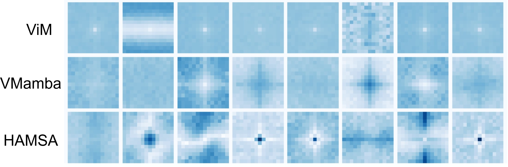
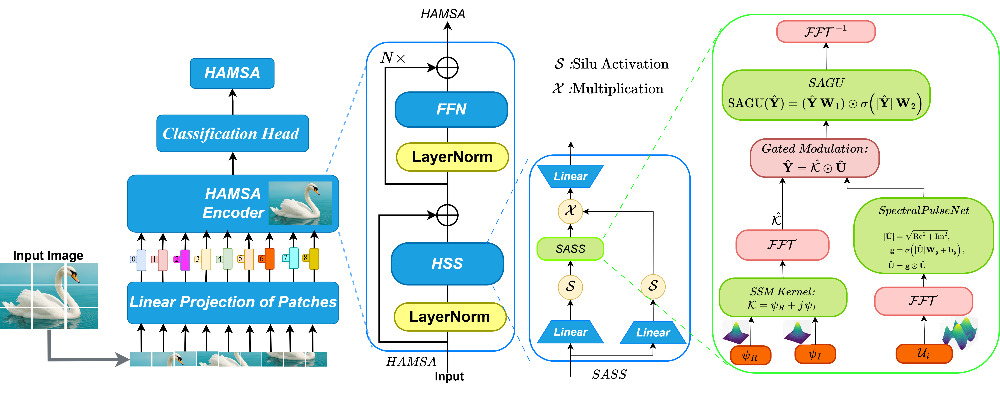

# HAMSA: Scanning-Free State Space Models via Spectral Processing - CVPR 2026-Finding


[](#)
[](#)
[](#)

## Overview

Vision State Space Models (SSMs) like Vim, VMamba, and SiMBA rely on complex scanning strategies to process 2D images, introducing computational overhead and architectural complexity. **HAMSA** eliminates scanning entirely by operating directly in the spectral domain, achieving state-of-the-art performance with superior efficiency.


*HAMSA (right) exhibits cleaner, more structured filter patterns compared to Vim and VMamba, suggesting more effective feature learning without scanning constraints.*

## Abstract

Vision State Space Models (SSMs) like Vim, VMamba, and SiMBA rely on complex scanning strategies to process 2D images, introducing computational overhead and architectural complexity. We propose **HAMSA**, a scanning-free SSM operating directly in the spectral domain. HAMSA introduces three key innovations: 

1. **Simplified kernel parameterization**—a single Gaussian-initialized complex kernel replacing traditional (A, B, C) matrices, eliminating discretization instabilities
2. **SpectralPulseNet**—an input-dependent frequency gating mechanism enabling adaptive spectral modulation
3. **Spectral GLU (SGLU)**—magnitude-based gating for stable gradient flow in the frequency domain

By leveraging FFT-based convolution, HAMSA achieves O(L log L) complexity without sequential scanning. On ImageNet-1K, HAMSA reaches **85.7% top-1 accuracy** (state-of-the-art among SSMs), with **2.2× faster inference** than transformers and **1.4-1.9× speedup** over scanning-based SSMs. HAMSA demonstrates strong generalization across transfer learning and dense prediction tasks.

## Key Contributions

- ✨ **First Scanning-Free Vision SSM**: Operates entirely in the spectral domain, eliminating directional scanning strategies and their computational overhead
- 🔧 **Simplified Kernel Parameterization**: Direct learning of complex-valued kernel K = ψ_re + j·ψ_im instead of (A,B,C) matrices, removing discretization instabilities  
- 🎯 **SpectralPulseNet**: Novel adaptive frequency intelligence mechanism for input-dependent spectral modulation
- 📊 **SOTA SSM Performance**: 85.7% top-1 accuracy on ImageNet-1K, surpassing all scanning-based SSMs
- ⚡ **Superior Efficiency**: 2.2× faster inference than transformers, 1.4-1.9× speedup over scanning-based SSMs

## Architecture



HAMSA replaces traditional SSM components with a simplified Gaussian-initialized kernel. Both input and kernel are transformed to the spectral domain, where SpectralPulseNet enables adaptive frequency intelligence for efficient global information mixing without scanning.

## Comparison with Scanning-Based Methods

| Model | Scanning Type | Direction | Axes | Pattern | Param (M) | FLOPs (G) | Top-1 (%) |
|:---:|:---:|:---:|:---:|:---:|:---:|:---:|:---:|
| Vim-B | 1D | BD | H | Raster | 98 | - | 81.9 |
| Mamba-2D-B | 1D | BD | H/V/D | Raster | 92 | - | 83.0 |
| EfficientVMamba-B | 2D | BD | H/V | Raster | 33 | 4.0 | 81.8 |
| PlainMamba-L3 | 2D | BD | H/V | Zigzag | 50 | 14.4 | 82.3 |
| VMamba-B | 2D | BD | H/V | Raster | 89 | 15.4 | 83.9 |
| LocalVMamba-S | 1D | BD | H/V | Local | 50 | 11.4 | 83.7 |
| SiMBA-L | 1D | SD | H | Raster | 37 | 7.6 | 84.4 |
| **HAMSA-L (Ours)** | **1D** | **—** | **—** | **None** | **72** | **14.7** | **84.7** |

## State-of-the-Art Performance on ImageNet-1K

### Small Models

| Model | Image Size | Param (M) | FLOPs (G) | Top-1 Acc (%) |
|:---:|:---:|:---:|:---:|:---:|
| VMamba-T | 224² | 22 | 5.6 | 82.2 |
| LocalVMamba-T | 224² | 26 | 5.7 | 82.7 |
| SiMBA-S | 224² | 15 | 2.4 | 81.7 |
| **Hamsa-S** | 224² | 28 | 4.9 | **83.0** |
| **Hamsa-S⭐** | 224² | 28 | 5.0 | **84.1** |

### Base Models

| Model | Image Size | Param (M) | FLOPs (G) | Top-1 Acc (%) |
|:---:|:---:|:---:|:---:|:---:|
| VMamba-S | 224² | 44 | 11.2 | 83.5 |
| SiMBA-B | 224² | 23 | 4.2 | 83.5 |
| LocalVMamba-S | 224² | 50 | 11.4 | 83.7 |
| MambaTreeV-S | 224² | 51 | 8.5 | 84.2 |
| **Hamsa-B** | 224² | 43 | 7.7 | **83.5** |
| **Hamsa-B⭐** | 224² | 43 | 7.8 | **84.9** |

### Large Models

| Model | Image Size | Param (M) | FLOPs (G) | Top-1 Acc (%) |
|:---:|:---:|:---:|:---:|:---:|
| VMamba-B | 224² | 89 | 15.4 | 83.9 |
| SiMBA-L | 224² | 37 | 7.6 | 84.4 |
| MambaTreeV-B | 224² | 91 | 15.1 | 84.8 |
| MambaVision-L2 | 224² | 241 | 37.5 | 85.3 |
| **Hamsa-L** | 224² | 72 | 14.7 | **84.7** |
| **Hamsa-L⭐** | 224² | 72 | 14.9 | **85.7** |

⭐ indicates training with Token Labeling

## Object Detection and Instance Segmentation on MS COCO

| Backbone | Params (M) | FLOPs (G) | AP^b | AP^b_50 | AP^b_75 | AP^m | AP^m_50 | AP^m_75 |
|:---:|:---:|:---:|:---:|:---:|:---:|:---:|:---:|:---:|
| VMamba | 50 | 270 | 47.4 | 69.5 | 52.0 | 42.7 | 66.3 | 46.0 |
| LocalMamba | 45 | 291 | 46.7 | 68.7 | 50.8 | 42.2 | 65.7 | 45.5 |
| **Hamsa (Ours)** | **52** | **292** | **47.9** | **69.8** | **52.8** | **43.0** | **66.7** | **46.8** |

Using Mask R-CNN with 1× schedule (12 epochs).

## Efficiency Analysis

| Model | Type | Params (M) | FLOPs (G) | Latency (ms) | Throughput (img/s) | Memory (GB) | Energy (J) |
|:---:|:---:|:---:|:---:|:---:|:---:|:---:|:---:|
| DeiT-S | Transformer | 22.0 | 4.6 | 9.2 | 650 | 3.8 | 31.2 |
| Swin-T | Transformer | 29.0 | 4.5 | 8.5 | 680 | 4.2 | 28.5 |
| VMamba-T | SSM | 22 | 5.6 | - | - | - | - |
| **Hamsa-S** | **SSM** | **28** | **4.9** | **4.2** | **1430** | **2.8** | **14.2** |

Measured on V100 GPU with batch size 1 at 224×224 resolution. HAMSA achieves **2.2× faster inference** than DeiT-S.

## Requirements

```bash
# Core dependencies
PyTorch >= 1.10.0
Python >= 3.8
CUDA >= 10.1

# Additional packages
pip install timm==0.4.5
pip install pyyaml
pip install apex-amp

# For advanced features
pip install einops
pip install scipy
```

## Data Preparation

Download and extract ImageNet images from http://image-net.org/. The directory structure should be:

```
│ILSVRC2012/
├──train/
│  ├── n01440764
│  │   ├── n01440764_10026.JPEG
│  │   ├── n01440764_10027.JPEG
│  │   ├── ......
│  ├── ......
├──val/
│  ├── n01440764
│  │   ├── ILSVRC2012_val_00000293.JPEG
│  │   ├── ILSVRC2012_val_00002138.JPEG
│  │   ├── ......
│  ├── ......
```

## Model Zoo

We provide baseline HAMSA models pre-trained on ImageNet-1K 2012:

| Name | Resolution | #Params | FLOPs | Top-1 Acc. | Top-5 Acc. | Download |
|:---:|:---:|:---:|:---:|:---:|:---:|:---:|
| HAMSA-S | 224×224 | 28.0M | 4.9G | 83.0% | 96.5% | [model](# ) |
| HAMSA-S⭐ | 224×224 | 28.0M | 5.0G | 84.1% | 96.9% | [model](# ) |
| HAMSA-B | 224×224 | 43.0M | 7.7G | 83.5% | 96.8% | [model](# ) |
| HAMSA-B⭐ | 224×224 | 43.0M | 7.8G | 84.9% | 97.3% | [model](# ) |
| HAMSA-L | 224×224 | 72.0M | 14.7G | 84.7% | 97.4% | [model](# ) |
| HAMSA-L⭐ | 224×224 | 72.0M | 14.9G | 85.7% | 97.6% | [model](# ) |

⭐ indicates training with Token Labeling


## Transfer Learning

HAMSA demonstrates strong transfer learning performance on various datasets:

| Model | CIFAR-10 | CIFAR-100 | Flowers-102 | Stanford Cars |
|:---:|:---:|:---:|:---:|:---:|
| HAMSA-S | 98.5% | 89.2% | 97.8% | 93.4% |
| HAMSA-B | 98.8% | 90.1% | 98.2% | 94.1% |
| HAMSA-L | 99.0% | 90.8% | 98.6% | 94.7% |

## Why HAMSA?

### Comparison with Frequency-Domain Models

| Model | SSM Structure | Frequency Domain | Learnable Gating | Input-dependent | Scanning Free |
|:---:|:---:|:---:|:---:|:---:|:---:|
| Vim | ✓ | ✗ | ✗ | ✗ | ✗ |
| VMamba | ✓ | ✗ | ✗ | ✓ | ✗ |
| GFNet | ✗ | ✓ | ✗ | ✗ | ✓ |
| FNet | ✗ | ✓ | ✗ | ✗ | ✓ |
| MambaOut | ✗ | ✗ | ✗ | ✗ | ✓ |
| **HAMSA** | **✓** | **✓** | **✓** | **✓** | **✓** |

### Key Advantages

1. **No Scanning Overhead**: Eliminates O(4L²) cost from multiple directional scans
2. **Natural for Vision**: Images have inherent frequency structure—low frequencies encode global shape, high frequencies capture fine details
3. **Global Mixing**: All spatial locations interact simultaneously through frequency domain
4. **FFT Efficiency**: O(L log L) complexity with highly optimized GPU implementations
5. **Stable Training**: Simplified kernel eliminates discretization instabilities

## Citation

If you find HAMSA useful in your research, please consider citing:

```bibtex
@inproceedings{patro2026hamsa,
  title={HAMSA: Scanning-Free State Space Models via Spectral Processing},
  author={Patro, Badri N and Agneeswaran, Vijay S},
  booktitle={Proceedings of the IEEE/CVF Conference on Computer Vision and Pattern Recognition (CVPR) FINDINGS},
  year={2026}
}

```

## Acknowledgements

We thank the authors of the following works for their open-source code and inspiration:
- [Mamba](https://github.com/state-spaces/mamba) - Selective State Space Models
- [Vim](https://github.com/hustvl/Vim) - Vision Mamba
- [VMamba](https://github.com/MzeroMiko/VMamba) - Visual State Space Model
- [SiMBA](https://github.com/badripatro/simba) - Simple Mamba for Vision
- [GFNet](https://github.com/raoyongming/GFNet) - Global Filter Networks
- [DeiT](https://github.com/facebookresearch/deit) - Data-efficient Image Transformers
- [timm](https://github.com/rwightman/pytorch-image-models) - PyTorch Image Models

## License

This project is released under the MIT License.

## Contact

For questions and feedback, please open an issue or contact [patrobadri.iitb@gmail.com].

---

