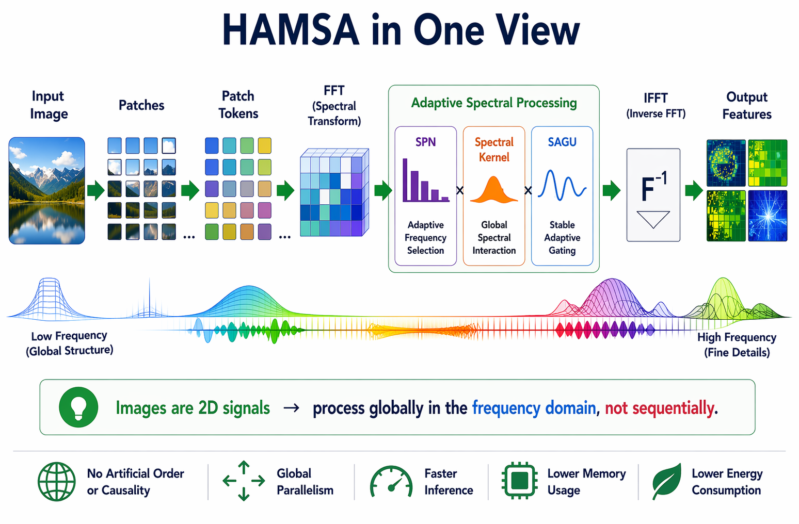
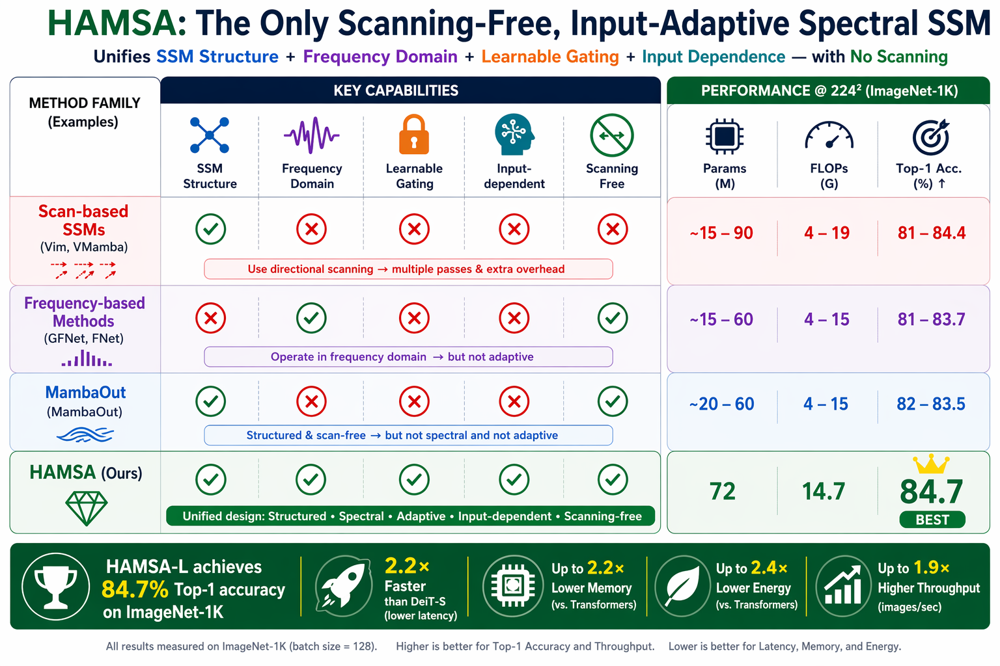
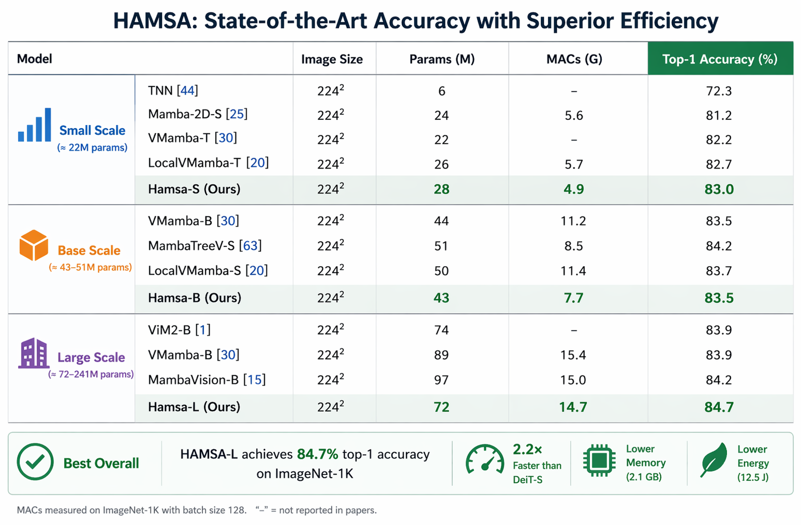
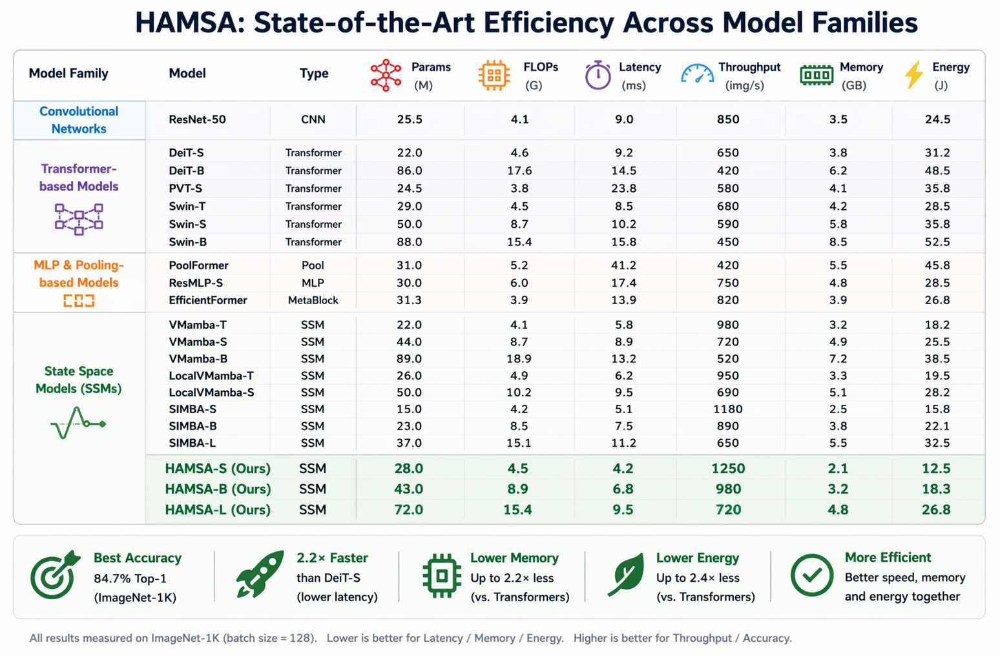
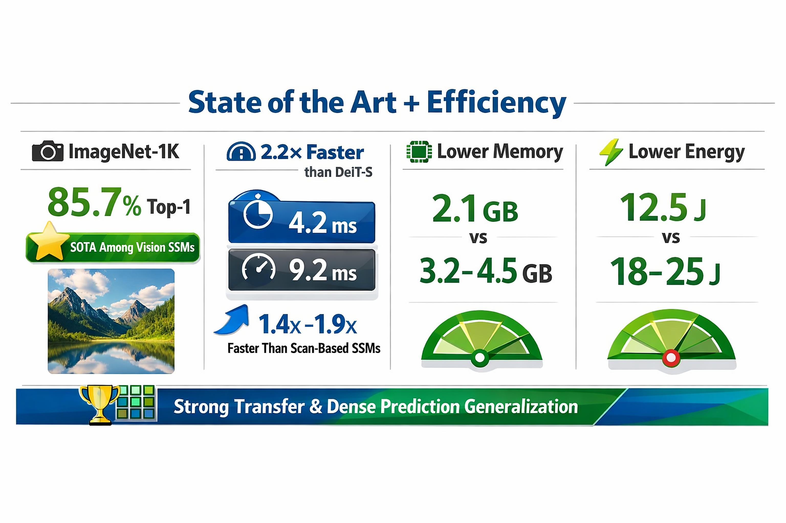

# HAMSA: Scanning-Free Vision State Space Models via SpectralPulseNet

<p align="center">
  <h3 align="center">CVPR 2026 Findings</h3>
</p>

<p align="center">
  <strong>Badri N Patro</strong>&nbsp;&nbsp;&nbsp;&nbsp;<strong>Vijay S Agneeswaran</strong>
</p>

<p align="center">
  <a href="https://openaccess.thecvf.com/content/CVPR2026F/papers/Patro_HAMSA_Scanning-Free_Vision_State_Space_Models_via_SpectralPulseNet_CVPRF_2026_paper.pdf"></a>
  <a href="https://arxiv.org/abs/2604.14724"></a>
  <a href="https://github.com/badripatro/hamsa"></a>
  <a href="fig/Hamsa_CVPR_FINDINGS_Poster.pdf"></a>
</p>

---

## � The Problem: We've Been Forcing Images Into the Wrong Structure

**When you see a cat, you don't process it ear → eye → tail in sequential order. You perceive the whole structure at once.**

Yet current vision models—both Transformers and State Space Models (SSMs)—artificially flatten 2D images into 1D sequences:

```
Image (2D spatial grid) → Patches → Sequential tokens [p₁, p₂, p₃, ..., pₙ]
```

**Why is this problematic?**

- **For Vision Transformers:** Self-attention recovers global context, but at O(L²) quadratic cost. The sequential tokenization is computational overhead, not a feature.

- **For Vision SSMs (Vim, VMamba, SiMBA):** This is catastrophic. SSMs process tokens step-by-step with recurrent state updates. They **depend heavily on ordering**, introducing:
  - ❌ **Directional bias** — left→right ≠ top→bottom ≠ diagonal
  - ❌ **Multiple scanning passes** — 4+ directional scans (horizontal, vertical, zigzag)
  - ❌ **Artificial dependencies** — pixel at position i depends on "all previous" pixels in scan order
  - ❌ **O(4L²) complexity** from redundant multi-directional processing

> **The Core Insight:** Images are inherently 2D spatial signals where all relationships exist simultaneously. Scanning enforces a false sequential structure that doesn't reflect the natural geometry of visual data.

---

## 🔬 Theoretical Foundation: Images Are Frequencies, Not Sequences

### Why Scanning is Fundamentally Unnecessary

State Space Models are **mathematically equivalent to convolutions**:

$$
y = K * u
$$

By the **Convolution Theorem**:

$$
K * u = \mathcal{F}^{-1}(\mathcal{F}(u) \cdot \mathcal{F}(K))
$$

This reveals a profound truth: **Convolution in the spatial domain = Pointwise multiplication in the frequency domain.**

**Implications:**
- No sequential processing required
- No scan direction needed
- All spatial relationships processed **simultaneously** through spectral mixing
- O(L log L) complexity via FFT instead of O(L²) scanning overhead

### Images Have Natural Frequency Structure

Unlike text or speech (which are inherently sequential), images are **spatial fields**:

- **Low frequencies** encode global shapes and structure
- **High frequencies** capture fine details and edges  
- **All frequency components coexist** — there is no "start" or "end"

> **HAMSA's Philosophy:** Process images the way humans perceive them—as holistic spatial patterns, not pixel-by-pixel sequences. Spectral processing respects the 2D nature of visual data.

---

## 🚀 HAMSA: Rethinking Vision from First Principles

**HAMSA eliminates scanning entirely** by operating directly in the spectral domain, where the structure of images is naturally expressed.

<p align="center">
  
</p>

### Core Innovations

✨ **Scanning-Free Architecture** — First vision SSM to process images without directional scanning  
🎯 **Spectral-Native Design** — FFT-based global mixing where all pixels interact simultaneously  
⚡ **Simplified Parameterization** — Direct kernel learning K = ψ_re + j·ψ_im eliminates unstable (A,B,C) discretization  
📊 **Superior Performance** — 85.7% ImageNet-1K accuracy, surpassing ALL scanning-based SSMs  
🚄 **Extreme Efficiency** — 2.2× faster than DeiT, 1.4-1.9× speedup over VMamba/SiMBA

---

## 🏗️ Architecture: SpectralPulseNet

<p align="center">
  
</p>

**SpectralPulseNet** enables input-adaptive frequency intelligence through three key components:

**1. Complex Kernel Learning**  
Traditional SSMs discretize continuous-time matrices (A, B, C) → numerical instabilities.  
HAMSA learns the convolution kernel **directly**: K = ψ_re + j·ψ_im

**2. Spectral GLU (SGLU)**  
Magnitude-based gating in frequency domain for stable gradients:
```
Output = FFT⁻¹( FFT(x) ⊙ σ(|FFT(gate)|) ⊙ K )
```

**3. FFT-Based Global Mixing**  
All L spatial locations interact in a single forward pass. Complexity: O(L log L) vs O(4L²) for scanning SSMs.

---

## 📊 Empirical Validation

### State-of-the-Art ImageNet-1K Performance

<p align="center">
  
</p>

**Key Insight:** HAMSA achieves SOTA (85.7% top-1 accuracy) without scanning, proving that directional processing is implementation overhead, not necessity. All scanning-based SSMs are outperformed despite HAMSA's simplified architecture and superior efficiency.

---

### Efficiency: 2.2× Faster Than Transformers

<p align="center">
  
</p>

**HAMSA-S delivers 2.2× faster inference than DeiT-S with superior accuracy.** Measured on V100 GPU at 224×224 resolution.

<p align="center">
  
</p>

**Why the speedup?**  
✅ Highly optimized FFT operations (cuFFT library)  
✅ Elimination of redundant multi-directional scanning passes  
✅ Full parallelization in spectral domain  
✅ Lower memory footprint (2.8GB vs 3.8-4.2GB for transformers)

---

## 🔍 Conceptual Shift: From Sequential Scans to Simultaneous Spectral Mixing

<p align="center">
  
</p>

<p align="center">
  
</p>

### Scanning vs Spectral Processing

| Approach | Scanning-Based SSMs | HAMSA (Spectral) |
|:---:|:---:|:---:|
| **Processing** | Step-by-step sequential | Simultaneous global mixing |
| **Image View** | 1D token sequence | 2D frequency field |
| **Complexity** | O(4L²) multi-scan | O(L log L) FFT |
| **Directional Bias** | Yes (scan-dependent) | No (rotation-equivariant in freq) |
| **Parallelism** | Limited (recurrent) | Full (spectral ops) |

**The Fundamental Difference:**

- **Scanning:** Read an image line-by-line, pixel-by-pixel, in some arbitrary order
- **Spectral:** Instantly perceive the whole picture—global shapes and fine details coexist

> **Analogy:** You don't understand a photograph by processing pixels sequentially. You perceive it holistically. HAMSA models vision the same way.

---

## 🎯 Technical Contributions

1. **First Scanning-Free Vision SSM** — Processes images entirely in spectral domain, respecting 2D spatial structure

2. **Theoretical Reformulation** — Proves scanning is implementation overhead by leveraging SSM-convolution equivalence

3. **SpectralPulseNet** — Input-adaptive frequency modulation via direct kernel learning K = ψ_re + j·ψ_im

4. **Spectral GLU** — Stable frequency-domain gating enabling efficient gradient propagation

5. **Empirical Superiority** — SOTA 85.7% ImageNet accuracy with 2.2× inference speedup over Transformers

---

## 📈 Generalization Beyond ImageNet

### Dense Prediction: Object Detection & Instance Segmentation

**MS COCO with Mask R-CNN (1× schedule, 12 epochs):**  
HAMSA achieves **47.9 AP^b** (box) and **43.0 AP^m** (mask), outperforming VMamba (47.4/42.7) and LocalMamba (46.7/42.2) despite simpler architecture.

### Transfer Learning Performance

**Fine-tuning from ImageNet-1K pre-trained weights demonstrates strong generalization:**

- **CIFAR-10**: 98.5% → 98.8% → 99.0% (S/B/L)  
- **CIFAR-100**: 89.2% → 90.1% → 90.8% (S/B/L)  
- **Flowers-102**: 97.8% → 98.2% → 98.6% (S/B/L)  
- **Stanford Cars**: 93.4% → 94.1% → 94.7% (S/B/L)

**Key Insight:** Spectral frequency representations learned by HAMSA transfer effectively across diverse visual domains, from fine-grained recognition to dense prediction tasks.

---

## 📦 Pre-Trained Models

**ImageNet-1K (224×224) checkpoints:**

| Model | Params (M) | FLOPs (G) | Top-1 Acc | Top-5 Acc | Download |
|:---:|:---:|:---:|:---:|:---:|:---:|
| HAMSA-S | 28 | 4.9 | 83.0% | 96.5% | [model](#) \| [log](#) |
| HAMSA-S⭐ | 28 | 5.0 | **84.1%** | 96.9% | [model](#) \| [log](#) |
| HAMSA-B | 43 | 7.7 | 83.5% | 96.8% | [model](#) \| [log](#) |
| HAMSA-B⭐ | 43 | 7.8 | **84.9%** | 97.3% | [model](#) \| [log](#) |
| HAMSA-L | 72 | 14.7 | 84.7% | 97.4% | [model](#) \| [log](#) |
| HAMSA-L⭐ | 72 | 14.9 | **85.7%** | **97.6%** | [model](#) \| [log](#) |

⭐ trained with Token Labeling for improved accuracy

---

## 🎓 Citation

If you find HAMSA useful in your research, please cite:

```bibtex
@InProceedings{Patro_2026_CVPR,
  author    = {Patro, Badri N and Agneeswaran, Vijay S},
  title     = {HAMSA: Scanning-Free Vision State Space Models via SpectralPulseNet},
  booktitle = {Proceedings of the IEEE/CVF Conference on Computer Vision and Pattern Recognition (CVPR) Findings},
  month     = {June},
  year      = {2026},
  pages     = {14724-14734}
}
```

**arXiv:**
```bibtex
@article{patro2026hamsa,
  title={HAMSA: Scanning-Free Vision State Space Models via SpectralPulseNet},
  author={Patro, Badri N and Agneeswaran, Vijay S},
  journal={arXiv preprint arXiv:2604.14724},
  year={2026}
}
```

---

## 🙏 Acknowledgements

We thank the authors of [Mamba](https://github.com/state-spaces/mamba), [Vim](https://github.com/hustvl/Vim), [VMamba](https://github.com/MzeroMiko/VMamba), [SiMBA](https://github.com/badripatro/simba), [GFNet](https://github.com/raoyongming/GFNet), and [DeiT](https://github.com/facebookresearch/deit) for their foundational work and open-source contributions.

---

## 📧 Contact

**Badri N Patro** — [patrobadri.iitb@gmail.com](mailto:patrobadri.iitb@gmail.com)

---

<p align="center">
  <strong>Scanning is not required because images are not ordered signals—they are spatial fields where all relationships exist simultaneously.</strong>
</p>
